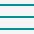

  <nav>
    <header>
      

      

        <ul class="flex-center logo-head">
          <li>
            
          </li>
          <li id="separator">
            
          </li>
          <li id="logo-headline" class="logo-headline">
            See for yourself. No strings attached
          </li>
        </ul>
      

      

        <ul id="menu-link-small-screen-icon" onclick="OpenNavBar()">
          <li>
            
          </li>
        </ul>
      

      

        <ul id="menu-links" class="menu-links">
          <li><a href="https://infineq.com">Home</a></li>
          <li><a href="https://infineq.com/#features">Features</a></li>
          <li><a href="https://infineq.com/#video">Watch Demo</a></li>
          <li><a href="https://infineq.com/blog">Blog</a></li>
          <li><a href="#">Docs</a></li>
        </ul>
        <ul class="request-access flex-center">
          <a href="https://infineq.com/blog#request-access" target="_blank" rel="noopener noreferrer">Request access</a>
        </ul>
      

        

          <ul>
            <li onclick="CloseNavBar()">
              
            </li>
            <li><a href="https://infineq.com">Home</a></li>
            <li><a href="https://infineq.com/#features">Features</a></li>
            <li><a href="https://infineq.com/#video">Watch Demo</a></li>
            <li><a href="https://infineq.com/blog">Blog</a></li>
            <li><a href="#">Docs</a></li>
          </ul>
        

      

    </header>
  </nav>
